# 新建centos虚拟机
1、选择自定义，下一步

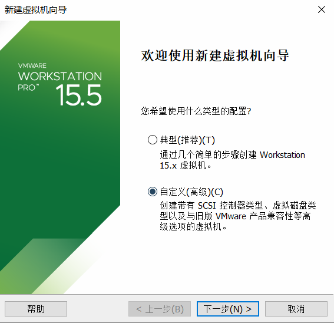

2、默认，下一步

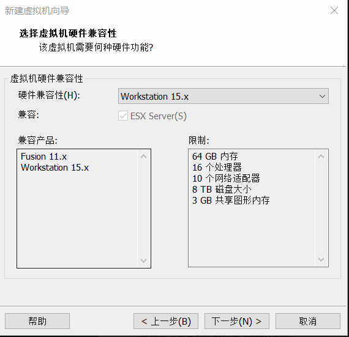

3、选择稍后安装操作系统，下一步
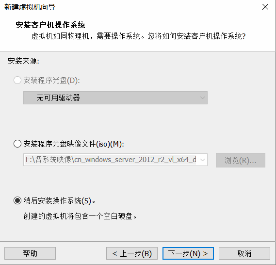

4、选择Linux、版本为centos7 64位
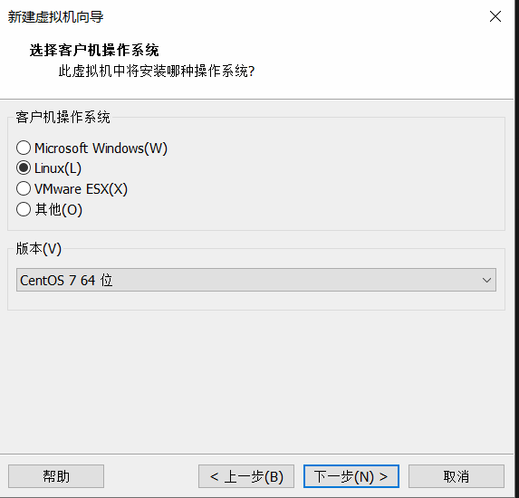

5、给创建的虚拟机取一个名字并选择保存位置。
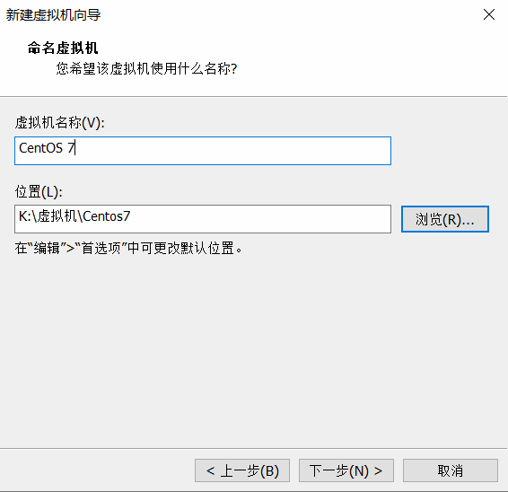

6、给创建的虚拟机配置处理器
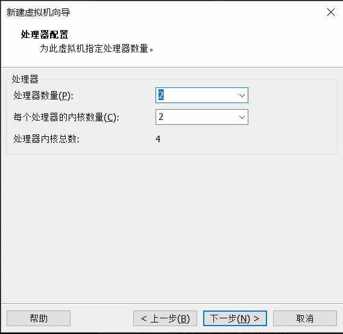

7、给创建的虚拟机分配内存
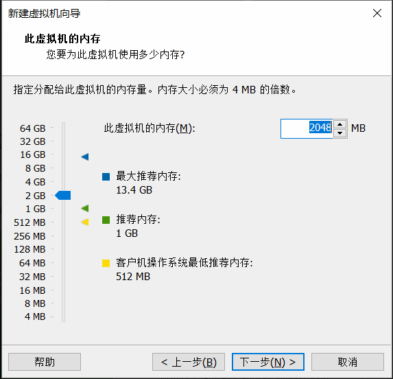

8、选择网络类型
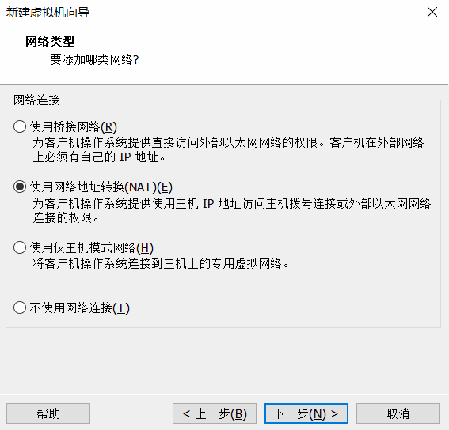

9、给创建的虚拟机分配磁盘大小
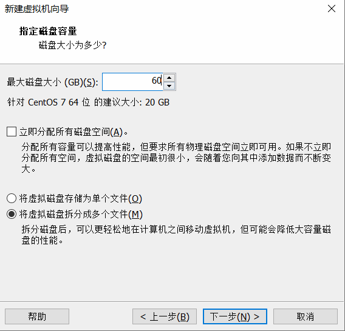

10、创建完成
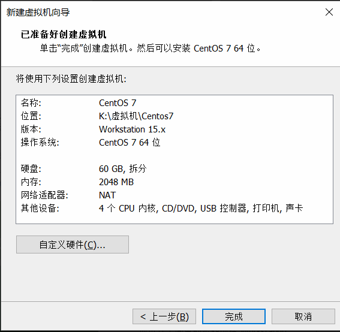

11、选择创建的虚拟机，点击鼠标右键，虚拟机设置，添加ISO镜像文件
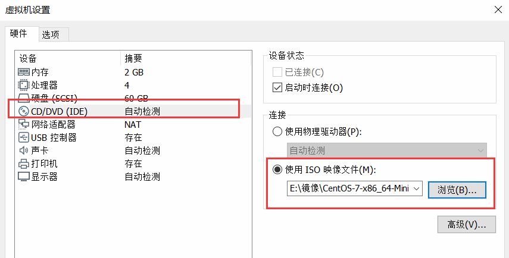

12、开启虚拟机，选择第一个
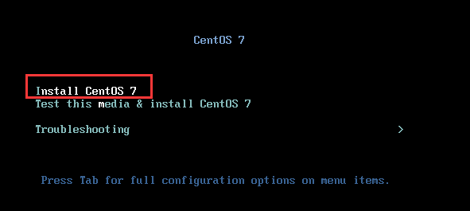

13、选择语言，建议使用英语
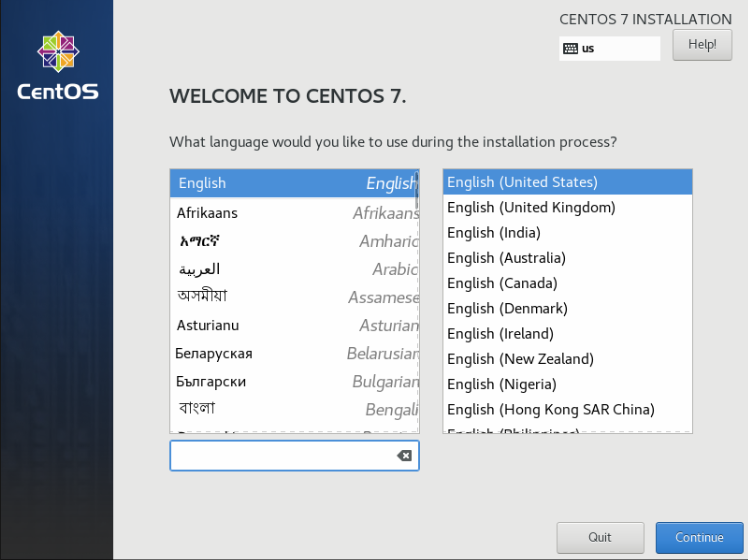

14、修改系统时间
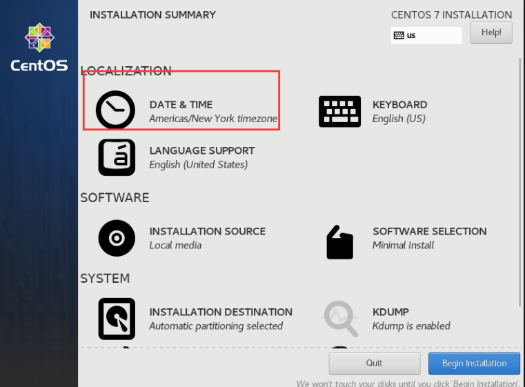
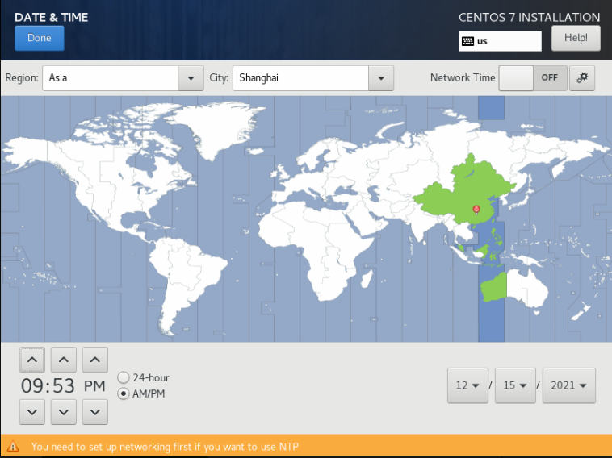

15、下一步
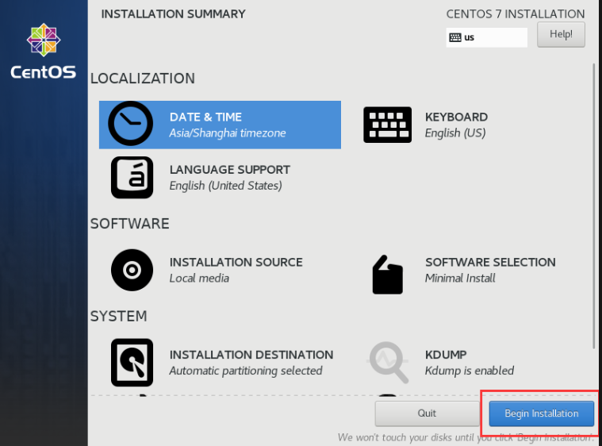

15、设置root密码
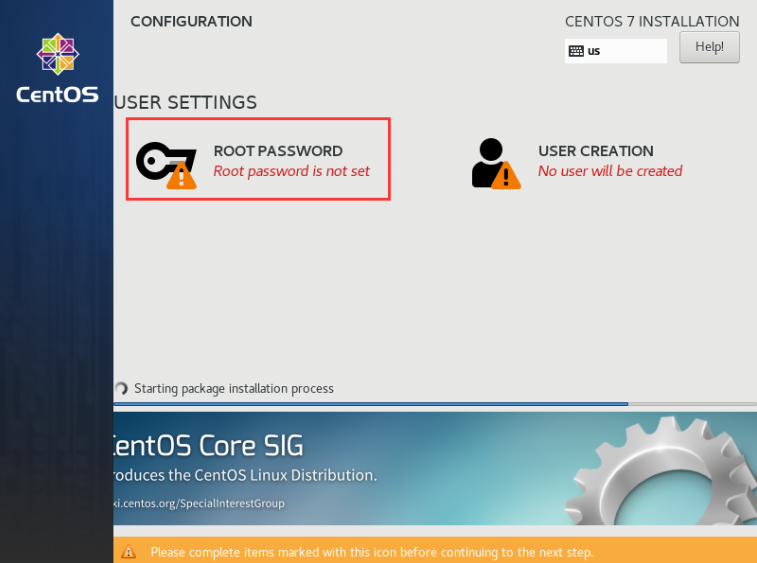

16、等待进度条加载完毕，重启


17、查看IP
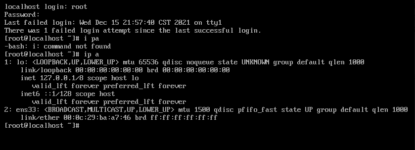

18、设置IP，我这里是192.168.10.0网段
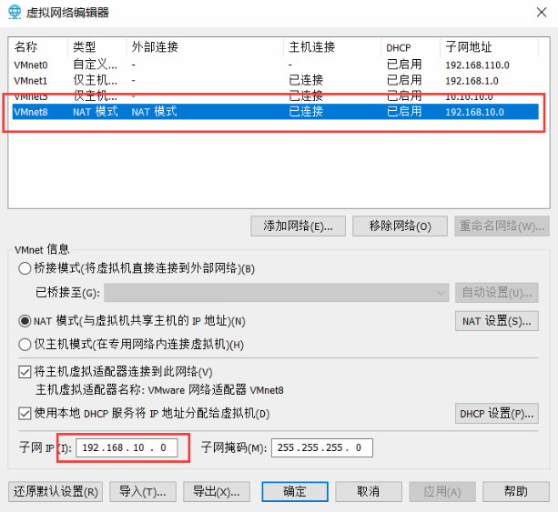

19、修改/etc/sysconfig/network-scripts/ifcfg-ens33的内容
```
vi  /etc/sysconfig/network-scripts/ifcfg-ens33
```

添加内容如下
```
修改：
BOOTPROTO=static
ONBOOT=yes
添加：
IPADDR=192.168.10.60
NETMASK=255.255.255.0
GATEWAY=192.168.10.1
DNS=114.114.114.114
```
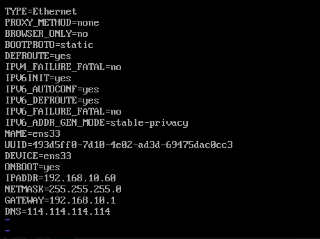

20、重启网卡
```
service network restart
```
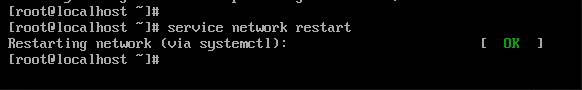


# 搭建Nginx
1、安装gcc
```
yum install -y gcc c++
```

2、PCRE pcre-devel 安装，nginx 的 http 模块使用 pcre 来解析正则表达式，所以需要在 linux 上安装 pcre 库，pcre-devel 是使用 pcre 开发的一个二次开发库。
```
yum install -y pcre pcre-devel
```

3、zlib 安装，zlib 库提供了很多种压缩和解压缩的方式， nginx 使用 zlib 对 http 包的内容进行 gzip
```
yum install -y zlib zlib-devel
```

4、OpenSSL 安装，OpenSSL 是一个强大的安全套接字层密码库，囊括主要的密码算法、常用的密钥和证书封装管理功能及 SSL 协议，并提供丰富的应用程序供测试或其它目的使用。nginx 不仅支持 http 协议，还支持 https（即在ssl协议上传输http），所以需要在 Centos 安装 OpenSSL 库。
```
yum install -y openssl openssl-devel
```

5、直接下载`.tar.gz`安装包，地址：[https://nginx.org/en/download.html](https://nginx.org/en/download.html)
```
wget -c https://nginx.org/download/nginx-1.20.1.tar.gz
```
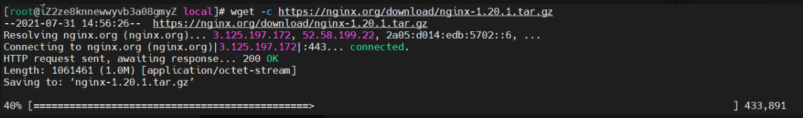

6、解压
```
tar -zxvf nginx-1.20.1.tar.gz
cd nginx-1.20.1
```
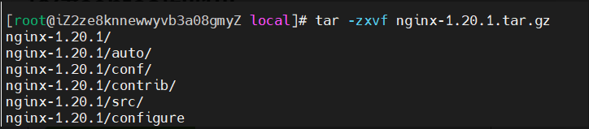

7、编译安装
```
./configure
make
make install
```
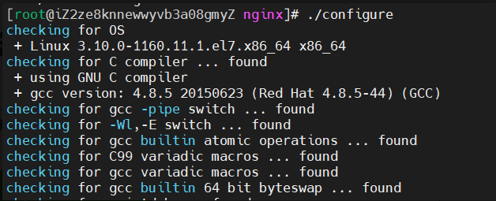
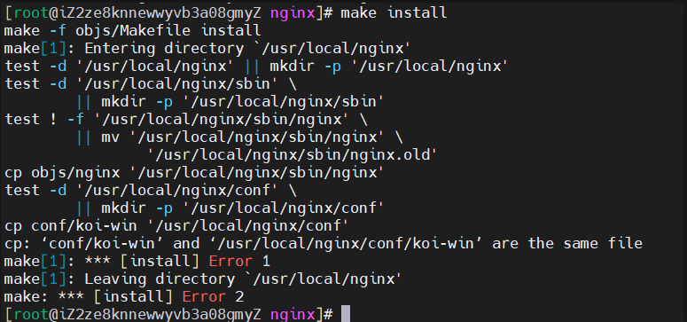

8、启动、停止nginx
```
cd /usr/local/nginx/sbin/
./nginx 
./nginx -s stop
./nginx -s quit
./nginx -s reload
```

9、开机自启
```
vi /etc/rc.local
```

增加一行 `/usr/local/nginx/sbin/nginx`<br />设置执行权限：
```
chmod 755 rc.local
```


# 搭建PHP

## 方法一
1、下载安装包
```
wget https://www.php.net/distributions/php-5.3.29.tar.gz
```

2、解压
```
tar -zxvf php-5.3.29.tar.gz
```
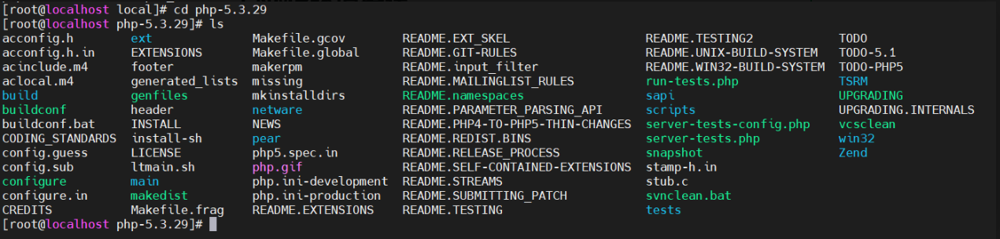


3、编译安装
```
./configure --prefix=/usr/local/php --enable-fpm
```
```
--prefix=/usr/local/php #这里是指定安装目录
--enable-fpm #这里是PHPFastCGI管理器，为了后面Nginx能解析PHP
```

出错
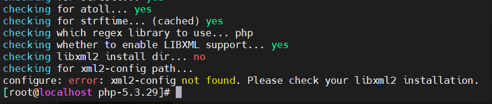

4、重新安装libxml2和libxml2-devel包
```
yum install -y libxml2
yum install libxml2-devel
```

5、再次编译
```
./configure --prefix=/usr/local/php --enable-fpm
```
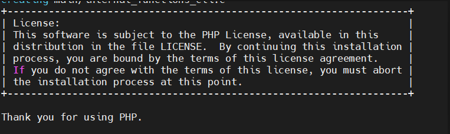

```
make && make install
```
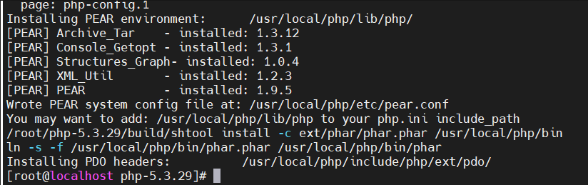

6、启动
```
cd /usr/local/php/   #先进入安装目录
mv ./etc/php-fpm.conf.default ./etc/php-fpm.conf    #重命名配置文件
./sbin/php-fpm   #启动
ps -aux |grep php-fpm  #查看启动状态
```
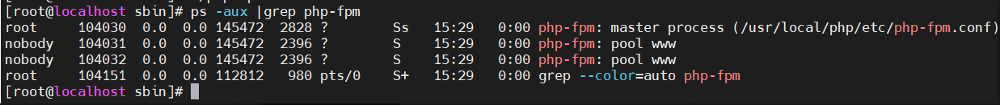


## 方法二
1、安装
```
yum -y install php-fpm php php-mysql php-gd libjpeg* php-ldap php-odbc php-pear php-xml php-xmlrpc php-mbstring php-bcmath php-mhash
```


## 配置Nginx解析PHP
1、进入到nginx安装目录修改配置文件
```
vi /usr/local/nginx/conf/nginx.conf
```

2、增加index.php
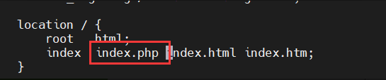

3、取消注释并修改
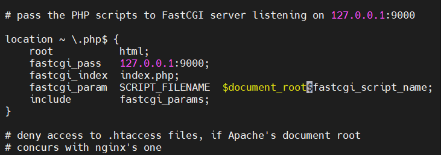

4、启动php-fpm服务
```
systemctl start php-fpm
```

5、Nginx的根目录下创建测试文件index.php
```php
<?php 
    phpinfo(); 
?>
```

6、重启nginx
```
nginx -s reload
```

7、在浏览器访问虚拟机IP测试
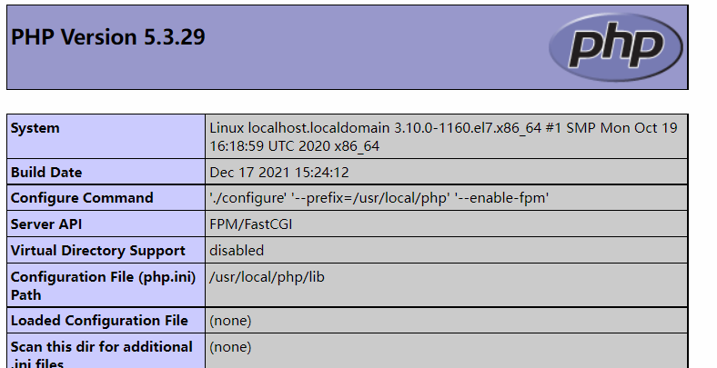


# 搭建Mysql
1、下载 MySQL 所需要的安装包https://dev.mysql.com/downloads/mysql/<br />CentOS 是基于红帽的，Select OS Version: 选择 linux 7

查看系统版本`uname -a`
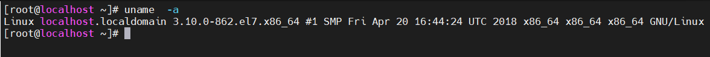

选择对应的版本下载
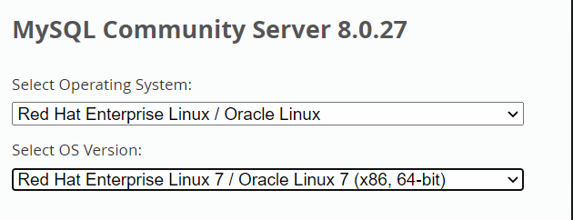

选择 RPM Bundle 点击 Download
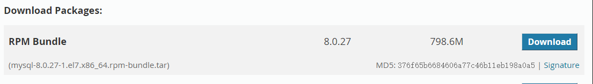

2、命令查看 mariadb 的安装包
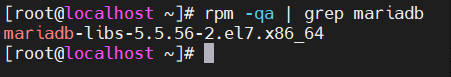

3、通过 rpm -e mariadb-libs-5.5.56-2.el7.x86_64 --nodeps 命令装卸 mariadb

4、在/usr/local/ 目录下创建一个名为 mysql 的目录
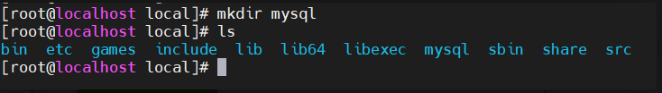

5、上传mysql的安装包
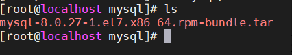

6、解压
```
tar -xvf mysql-8.0.27-1.el7.x86_64.rpm-bundle.tar
```


7、安装common
```
 rpm -ivh mysql-community-common-8.0.27-1.el7.x86_64.rpm --nodeps --force
```
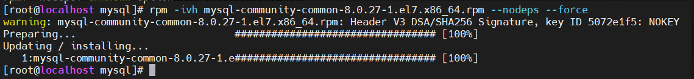

8、安装 lib
```
rpm -ivh mysql-community-libs-8.0.27-1.el7.x86_64.rpm --nodeps --force
```
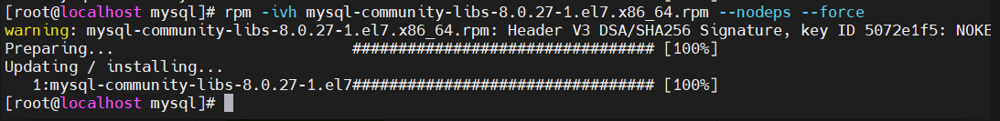


9、安装 client
```
rpm -ivh mysql-community-client-8.0.27-1.el7.x86_64.rpm --nodeps --force
```
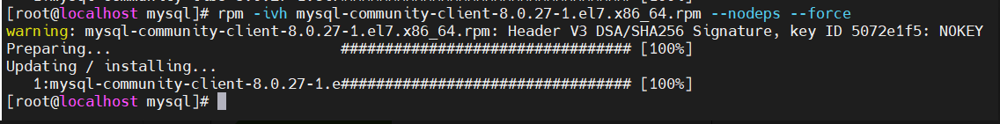

10、安装 server
```
rpm -ivh mysql-community-server-8.0.27-1.el7.x86_64.rpm --nodeps --force
```
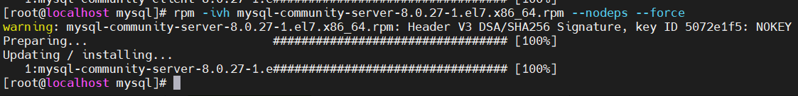

11、查看 mysql 的安装包
```
rpm -qa | grep mysql
```
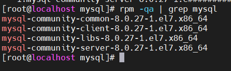

12、初始化和相关配置
```
mysqld --initialize;
chown mysql:mysql /var/lib/mysql -R;
systemctl start mysqld.service;
systemctl enable mysqld;
```
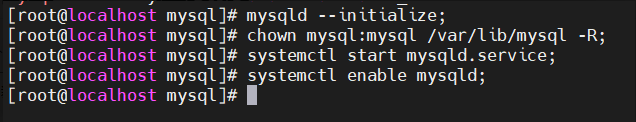

13、查看数据库的密码
```
cat /var/log/mysqld.log | grep password
```
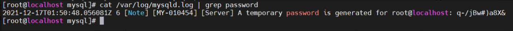

14、进入数据库登陆界面
```
mysql -uroot -p
```
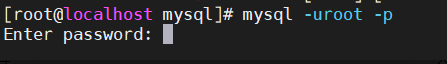

15、输入密码，进行数据库的登陆
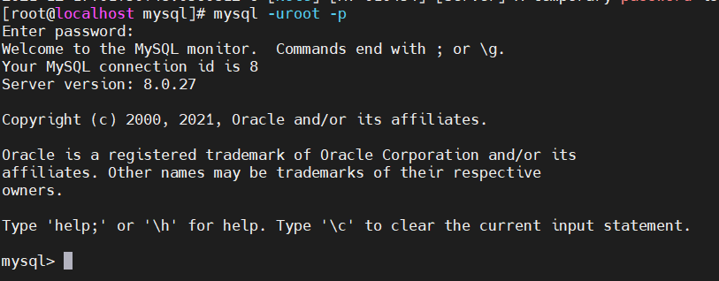

15、修改密码
```
ALTER USER 'root'@'localhost' IDENTIFIED WITH mysql_native_password BY 'password';
```
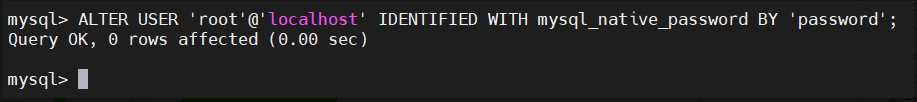

17、退出 MySQL，然后通过新密码再次登陆
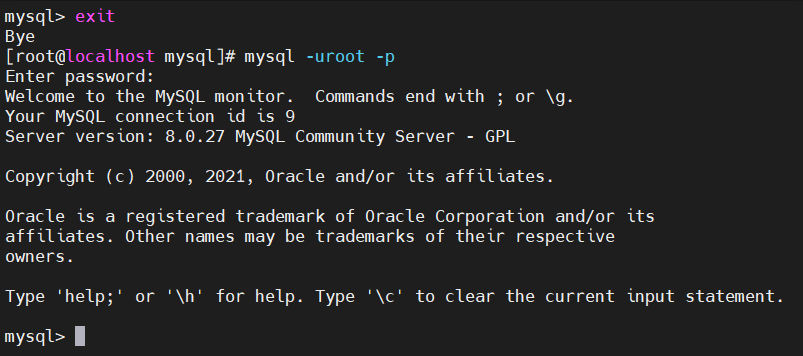

18、远程访问的授权
```
create user 'root'@'%' identified with mysql_native_password by 'password';
grant all privileges on *.* to 'root'@'%' with grant option;
flush privileges;
```
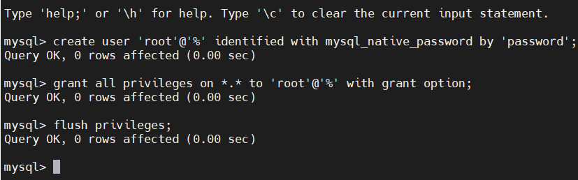

19、退出数据库，关闭防火墙
```
systemctl stop firewalld.service;
systemctl disable firewalld.service;
systemctl mask firewalld.service;
```
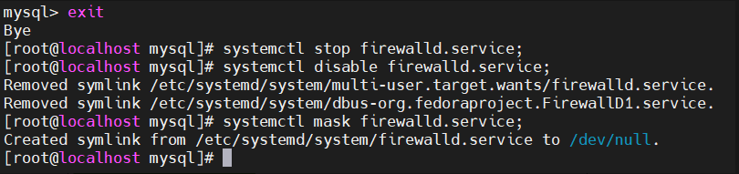


## 尝试远程连接数据库
成功
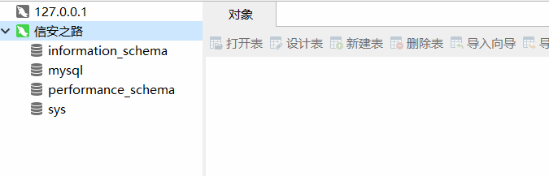


## 测试PHP连接数据库
```php
<?php
$con = mysql_connect("localhost","root","123456");
$select_db = mysql_select_db('mysql');
if (!$select_db) {
    die("could not connect to the db:\n" .  mysql_error());
}

//查询代码
$sql = "select * from test";
$res = mysql_query($sql);
if (!$res) {
    die("could get the res:\n" . mysql_error());
}
while ($row = mysql_fetch_assoc($res)) {
    print_r($row);
}

//关闭数据库连接
mysql_close($con);
?>
```

在浏览器访问，成功连接
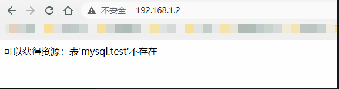

到此Web运行基础环境搭建完毕！！！
