# 一、MySQL数据库的内置函数
数据库的内置函数有很多，这里只列出在渗透测试中会涉及到的函数或者常用的函数。

## 1.1、字符串函数

### 1.1.1、测试举例
**ASII(s)：**返回字符串s的第一个字符的 ASCII 码。<br />**应用情景：**在SQL盲注中可以用来判断、表、列名称中的的某个字符。
```python
select ascii(substr((select database()),1,1));

判断当前数据库名称的第一个字符(s对应的ascii为115)
select ascii(substr((select database()),1,1))=115;
```
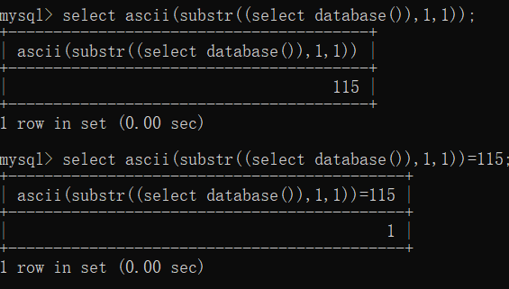

**CHAR_LENGTH(s)：**返回字符串s的字符数。<br />**LENGTH(s)：**返回字符串s的长度<br />**OCTET_LENGTH(s)：**返回字符串s的字符数。<br />**CHARACTER_LENGTH(s)：**返回字符串s的字符数。<br />**使用情景：**在SQL盲注的时候，不知道数据库的名称，可以先使用该函数确定数据库名称的字符数，再进行爆破。

```python
select char_length(database());
select length(database());
select octet_length(database());
select character_length(database());
```


**CONCAT(s1,s2...sn)：**字符串 s1,s2 等多个字符串合并为一个字符串。<br />**使用情景：**在SQL注入中可以使用该函数将用户名和密码一起输出，但是没有分割难以区分，建议使用**CONCAT_WS(s1,s2...sn)**函数。
```python
select concat(username,password) from security.users;
```
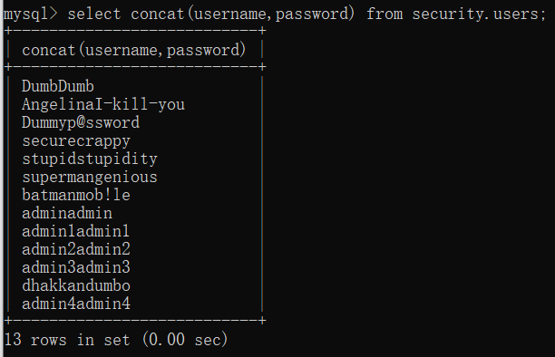

**CONCAT_WS(x,s1,s2...sn)：**同 CONCAT(s1,s2,...) 函数，但是每个字符串之间要加上 x，x 可以是分隔符。<br />**使用情景：**在SQL注入中可以使用该函数将用户名和密码一起输出。
```python
select concat_ws('-',username,password) from security.users;
```
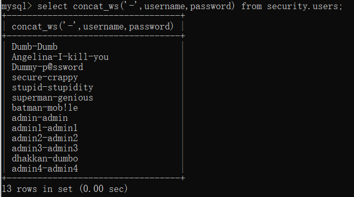

**INSERT(s1,x,len,s2)： **将字符串s2替换s1的x位置开始⻓度为len的字符串。
```python
select insert("aaabbbaaa",7,3,"ccc");
```
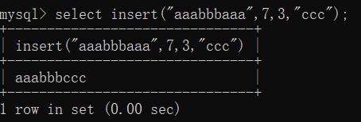

**UPPER(s)：**将字符串s的所有字符都变成⼤写字⺟<br />**UCASE(s)：**将字符串s的所有字符都变成⼤写字⺟
```python
select upper('xmTx');
select ucase('xMtx');
```
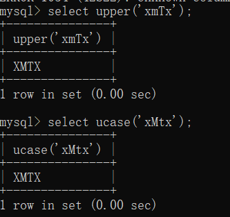

**LOWER(s)：**将字符串s的所有字符都变成⼩写字⺟。<br />**LCASE(s)：**将字符串s的所有字符都变成⼩写字⺟。
```python
select lower("XmTx");
select lcase("XmTx");
```
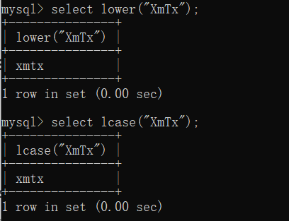

**LEFT(s,n)：**返回字符串s的前n个字符。

```python
select left("XMTX-XAZL",4);
```
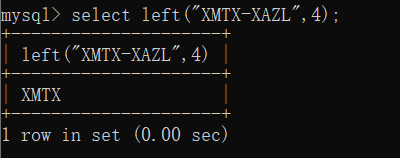

**RIGHT(s,n)：**返回字符串s的后n个字符  
```python
select right('XMTX',2);
```
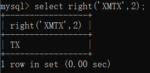

**LPAD(s1,len,s2)：**字符串s2来填充s1的开始处，使字符串⻓度达到len
```python
select lpad("XAZL",8,"XMTX");
```
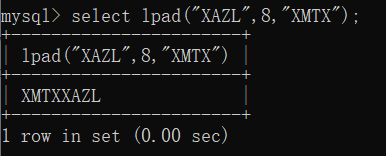

**RPAD(s1,len,s2)：**字符串s2来填充s1的结尾处，使字符串⻓度达到len  
```python
select rpad('XMTX',8,'M');
```


**LTRIM(s)：**去掉字符串s开始处的空格
```python
select ltrim("    XMTX-XAZL");
```
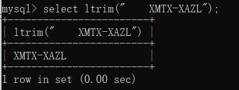

**RTRIM(s)：**去掉字符串s结尾处的空格  
```python
select rtrim('XMTX   ');
```
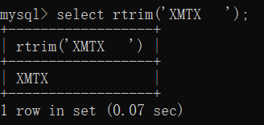

**TRIM(s)：**去掉字符串s开始处和结尾处的空格  
```python
select trim('   XMTX   ');
```


**REPEAT(s,n)：**将字符串s重复n次。
```python
select repeat("XMTX",2);
```
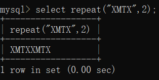

**SPACE(n)：**返回n个空格
```python
select space(6);
```
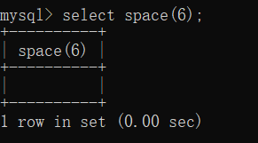

**REPLACE(s,s1,s2)：**⽤字符串s2代替字符串s中的字符串s1  
```python
select replace('ZMTZ','Z','X');
```


**STRCMP(s1,s2)：**⽐较字符串s 1和s 2  
```python
select strcmp('XMTX','XAZL');
```
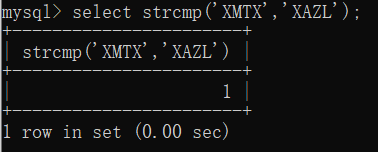

**SUBSTRING(s,n,len)：**获取从字符串s中的第n个位置开始⻓度为len的字符串 <br />**应用情景：**在SQL盲注中可以使用该函数用来爆破库、表、列的名称
```python
select substr((select database()),1,1)='s';
```
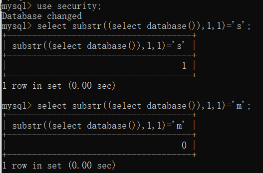

**MID(s,n,len)：**从字符串s的n位置截取长度为len的子字符串<br />**应用情景：**在SQL盲注中，可以用来爆破库、表、列的逐个字符。
```python
select mid((select database()),1,2)='se';
```
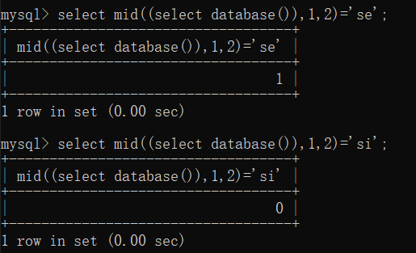

**REVERSE(s)：**将字符串s的顺序反过来  
```python
select reverse('XMTX');
```
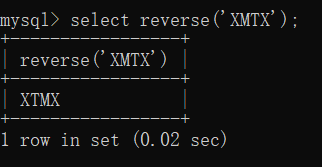

**FIELD(s,s1,s2...)：**返回第一个字符串 s 在字符串列表(s1,s2...)中的位置。

```python
select field('XMTX','XAZL','XMTX','XMTC');
```
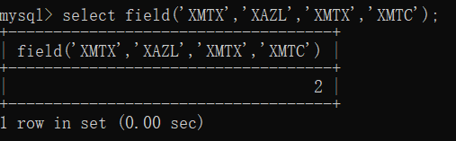

**FIND_IN_SET(s1,s2) ：**返回在字符串s2中与s1匹配的字符串的位置。
```python
select find_in_set('XMTX','XAZL,XMTX,XMTC');
```
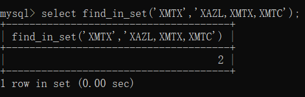

**FORMAT(x,n)：**格式化函数，可以将数字x进⾏格式化，将x保留到⼩数点后n 位，最后一位四舍五入。
```python
select format(520.1314,2);
```
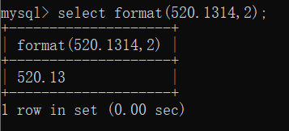

**RPAD(s1,len,s2)：**字符串s2来填充s1的结尾处，使字符串⻓度达到len  

```python
select rpad('XMTX',8,'M');
```


## 1.2、数字函数

### 1.2.1、测试举例
**ABS(x)：**返回x的绝对值
```python
select abs(-1);
```
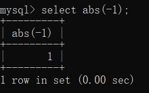

**CEIL(x)：**返回⼤于或等于x的最⼩整数（向上取整）<br />**CEILING(x)：**返回⼤于或等于x的最⼩整数（向上取整）
```python
select ceil(1.5);
select ceiling(1.5);
```
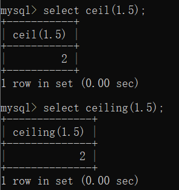

**FLOOR(x)：**返回⼩于或等于x的最⼤整数（向下取整）
```python
select floor(1.5);
```
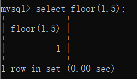

**RAND()：**返回0~1的随机数
```python
select rand();
```
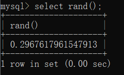

**SIGN(x)：**返回x的符号，x是负数、0、正数分别返回-1、0、1
```python
select sign(-666);
select sign(0);
select sign(666);
```


**PI()：**返回圆周率
```python
select pi();
```
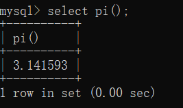

**TRUNCATE(x,y)：**返回数值x保留到⼩数点后y位的值
```python
select truncate(3.14159,2);
```
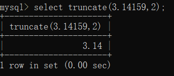

**ROUND(x)：**返回离x最近的整数（四舍五⼊）
```python
select round(1.4);
select round(1.5);
```
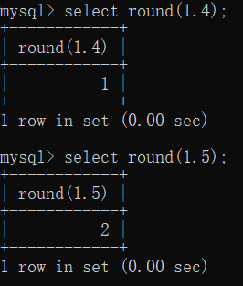

**ROUND(x,y)：**保留x⼩数点后y位的值，但截断时要四舍五
```python
select round(3.14159,2);
```
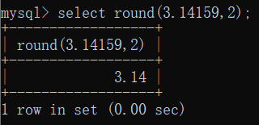

**POW(x,y)：**返回x的y次方<br />**POWER(x,y)：**返回x的y次方
```python
select pow(2,2);
select power(2,2);
```
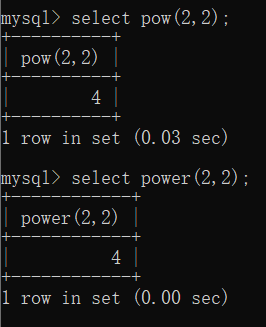

**SQRT(x)：**返回x的平方根
```python
select sqrt(4);
```
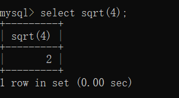

**EXP(x)：**返回e的x次
```python
select exp(2);
```


**MOD(x,y)：**返回x除以y以后的余数
```python
select mod(3,2);
```
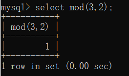

**LOG(x)：**返回⾃然对数（以e为底的对数）<br />**LOG10(x)：**返回以10为底的对数
```python
select log(2);
select log10(2);
```
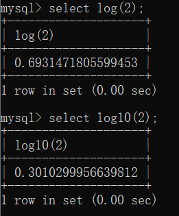

**RADIANS(x)：**将⻆度转换为弧度
```python
select radians(180);
```
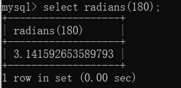

**DEGREES(x)：**将弧度转换为⻆度
```python
select degrees(3.141592653589793);
```
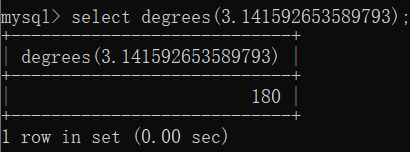


**SIN(x)：**求正弦值(参数是弧度) 
```python
select sin(radians(30));
```
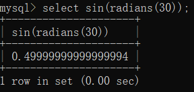

**ASIN(x)：**求反正弦值
```python
SELECT ASIN(0.25);
```
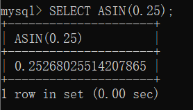

**COS(x)：**求余弦值
```python
SELECT COS(2);
```
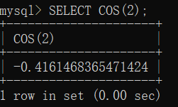

**ACOS(x)：**求反余弦值
```python
SELECT ACOS(0.25);
```
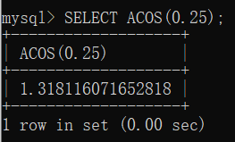

**TAN(x)：**求正切值
```python
SELECT TAN(1.75);
```


**ATAN(x)：**求反正切值
```python
SELECT ATAN(2.5);
```


**ATAN(x,y)：**求反正切值
```python
SELECT ATAN2(-0.8, 2);
```
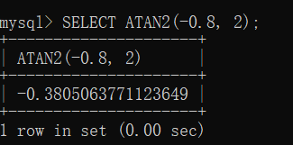

**COT(x)：**求余切值  
```python
SELECT COT(6);
```
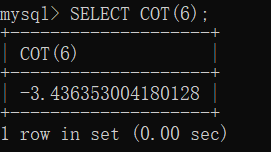


## 1.3、日期函数

### 1.3.1、测试举例
**CURDATE()：**返回当前⽇期<br />**CURRENT_DATE()：**返回当前⽇期
```python
select curdate();
select current_date();
```
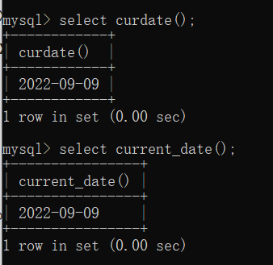

**CURTIME()：**返回当前时间<br />**CURRENT_TIME()：**返回当前时间
```python
select curtime();
select current_time();
```
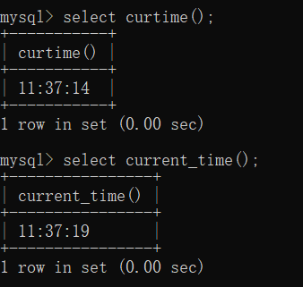

**NOW()：**返回当前⽇期和时间<br />**CURRENT_TIMESTAMP()：**返回当前⽇期和时间<br />**LOCALTIME()：**返回当前⽇期和时间<br />**SYSDATE()：**返回当前⽇期和时间<br />**LOCALTIMESTAMP()：**返回当前⽇期和时间
```python
select now();
select current_timestamp();
select localtime();
select sysdate();
select localtimestamp();
```
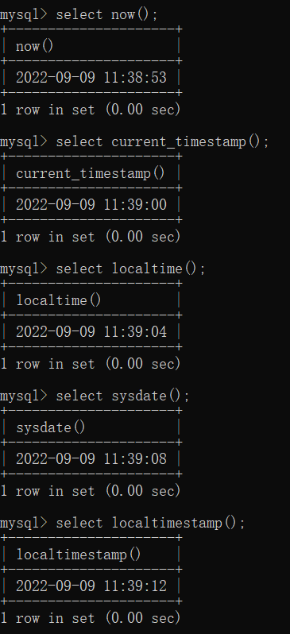

**UNIX_TIMESTAMP()：**以UNIX时间戳的形式返回当前时间<br />**UNIX_TIMESTAMP(d)：**将时间d以UNIX时间戳的形式返回
```python
select unix_timestamp();
select unix_timestamp('2022-09-09 11:43:30');
```
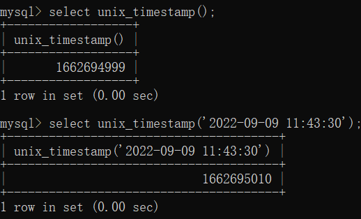

**FROM_UNIXTIME(d)：**把UNIX时间戳的时间转换为普通格式的时间
```python
select from_unixtime('1662695010');
```
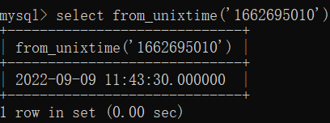

**UTC_DATE()：**返回UTC(国际协调时间)：⽇期
```python
select utc_date();
```
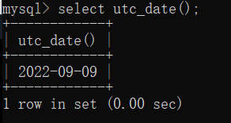

**UTC_TIME()：**返回UTC时间
```python
select utc_time();
```
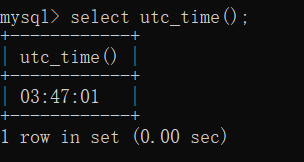

**MONTH(d)：**返回⽇期d中的⽉份值，范围是1~12<br />**MONTHNAME(d)：**返回⽇期d中的⽉份名称，如january
```python
select month('2022-09-09');
select monthname('2022-09-09');
```
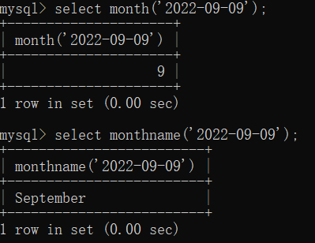

**DAYNAME(d)：**返回⽇期d是星期⼏，如Monday
```python
select dayname('2022-09-21');
```
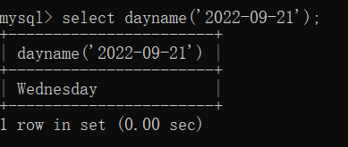

**DAYOFWEEK(d)：**返回⽇期d是星期⼏，1表示星期⽇，2表示星期一
```python
select dayofweek('2022-09-21');
```
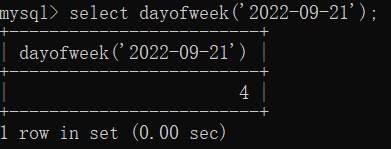

**WEEKDAY(d)：**返回⽇期d是星期⼏，0表示星期⼀,1表示星期2
```python
select weekday('2022-09-21');
```


**WEEK(d)：**计算⽇期d是本年的第⼏个星期，范围是0-53
```python
select week('2022-09-21');
```


**WEEKOFYEAR(d)：**计算⽇期d是本年的第⼏个星期，范围是1-53
```python
select weekofyear('2022-09-21');
```


**DAYOFYEAR(d)：**计算⽇期d是本年的第⼏天
```python
select dayofyear('2022-09-21');
```


**DAYOFMONTH(d)：**计算⽇期d是本⽉的第⼏天
```python
select dayofmonth('2022-09-21');
```


**YEAR(d)：**返回⽇期d中的年份值
```python
select year('2022-09-21');
```


**QUARTER(d)：**返回⽇期d是第⼏季度，范围1-4
```python
select quarter('2022-09-21');
```


**HOUR(t)：**返回时间t中的⼩时值
```python
select hour('10:09:21');
```


**MINUTE(t)：**返回时间t中的分钟值
```python
select minute('10:09:21');
```


**SECOND(t)：**返回时间t中的秒钟值
```python
select second('10:09:21');
```


**EXTRACT(type FROM d)：**从⽇期d中获取指定的值，type指定返回的值，如<br />YEAR,HOUR等
```python
select extract(year from "2022-09-21");
select extract(year_month from "2022-09-21");
```


**TIME_TO_SEC(t)：**将时间t转换为秒<br />**SEC_TO_TIME(s)：**将以秒为单位的时间s转换为时分秒的格式
```python
select time_to_sec('10:09:21');
select sec_to_time('36561');
```


**TO_DAYS(d)：**计算⽇期d到0000年1⽉1⽇的天数<br />**FROM_DAYS(n)：**计算从0000年1⽉1⽇开始n天后的⽇期
```python
select to_days('2022-09-21');
select from_days('2022-09-21');
```


**DATEDIFF(d1,d2)：**计算⽇期d1到d2之间相隔的天数
```python
select datediff('2022-09-21','2022-09-25');
```


**ADDDATE(d,n)：**计算开始⽇期d加上n天的⽇期<br />**SUBDATE(d,n)：**计算起始⽇期d减去n天的⽇期
```python
select adddate('2022-09-21','4');
select subdate('2022-09-21','1');
```


**ADDDATE(d,INTERVAL expr type)：**计算起始⽇期d加上⼀个时间段后的⽇期<br />**SUBDATE(d,INTERVAL expr type)：**计算起始⽇期d减去⼀个时间段后的⽇期
```python
select adddate('2022-09-21',interval 4 day);
select subdate('2022-09-21',interval 1 day);
```


**ADDTIME(t,n)：**计算起始时间t加上n秒的时间<br />**SUBTIME(t,n)：**计算起始时间t减去n秒的时间
```python
select addtime('2022-09-21 10:09:21',4);
select subtime('2022-09-21 10:09:21',1);
```


**DATE_FORMAT(d,f)：**按照表达式f的要求显示⽇期d<br />**TIME_FORMAT(t,f)：**按照表达式f的要求显示时间t
```python
select date_format('2022-09-21 10:09:21','%Y-%m-%d %r');
select time_format('10:09:21','%r');
```


## 1.4、MySQl中的高级函数

### 1.4.1、测试举例
**IF(expr,v1,v2)**：如果表达式expr成立，则返回 v1，否则返回 v2。<br />**应用情景：**在SQL盲注中，当我们不知道库、表、列的名称时可以用该函数来逐个判断名称中的字符。
```python
#判断当前数据库的首字母是不是s，是则返回Y，不是则返回N
select if(substr(database(),1,1)='s',Y,N);
```


**CASE WHEN expr1 THEN v1 WHEN expr2 THEN v2... ELSE vn END：**CASE 表示函数开始，END 表示函数结束。如果 condition1 成立，则返回 result1, 如果 condition2 成立，则返回 result2，当全部不成立则返回 result，而当有一个成立之后，后面的就不执行了。<br />**应用情景：**在SQL盲注中，当我们不知道库、表、列的名称时可以用该函数来逐个判断名称中的字符。
```python
select case 
	when (substr(database(),1,1)='a') THEN '1'
	when (substr(database(),1,1)='s') THEN '2'
	ELSE 'no' END;
```


**VERSION() **：返回数据库的版本号<br />**应用情景：**在SQL注入中可以使用该函数查看数据库版本号。
```python
select version();
```


**CONNECTION_ID()：**返回唯一的连接 ID
```python
select connection_id();
```


**DATABASE()：**返回当前数据库名<br />**应用情景：**在SQL注入中可以使用该函数查看数据库名。
```python
select database();
```


**USER()：**返回当前⽤户的名称<br />**应用情景：**在SQL注入中可以使用该函数查看用户名。
```python
select user();
```


**CHARSET(str) ：**返回字符串str的字符集
```python
select charset(security);
```


**LAST_INSERT_ID() ：**返回最后⽣成的auto_increment值
```python
select last_insert_id();
```


**BIN(x)： **返回x的⼆进制编码
```python
select bin(10);
```


**CONV(x,f1,f2) ：**将x从f 1进制数变成f 2进制数
```python
select conv(1010,2,10);
```


**CONVERT(s USING cs)：**将字符串s的字符集变成c s
```python
select charset(convert('security' using gbk));
```


**CAST(x AS type)：**转换数据类型
```python
select cast("2022-09-21" AS DATE);
```


# 二、通过数据库执行系统命令

## 2.1、UDF
UDF（Userdefined function）用户自定义函数，是mysql的一个拓展接口，可以为mysql增添一些函数。有时候我们需要对表中的数据进行一些处理而内置函数不能满足需要的时候，就需要对MySQL函数进行一些扩展，MySQL提供了添加新函数的机制，这种添加的MySQL函数就称为UDF。

- MySQL版本大于5.1，udf.dll文件必须放置在MySQL安装目录的lib\plugin文件夹下。目录默认是不存在的需要自己创建，在安装目录下创建lib\plugin文件夹，然后将udf.dll导入到这个目录。
- MySQL版本小于5.1，udf.dll文件在windows server 2003下放置于c:window\ssystem32目录在windows server 2000下放置在c:winnt\system32目录。


## 2.2、UDF利用条件

### 2.2.1、知道数据库的用户和密码
通过拿到webshell之后翻阅文件得到，对于不同情况下有不同得获取方式。


### 2.2.2、MySQL可以远程登录
在默认情况下，MySQL只允许本地登录，但是如果只允许本地登录的情况下，即使知道账号密码的情况下也不能够连接上mysql数据库，那么在这种情况下就只有通过拿到本机的高权限RDP登陆远程桌面后连接。<br />远程连接对应的设置在MySQL目录下的`/etc/mysql/my.conf`文件，对应的设置为`bind-address = 127.0.0.1`这一行，这是默认情况下的设置，如果要允许在任何主机上面都能够远程登录MySQL的话，就只要把`bind-address`改成0.0.0.0``即可。<br />仅仅更改配置文件还不够，还需要给远程登陆的用户赋予权限，首先新建一个`admin/123456`用户，使用`%`来允许任意`ip`登录`MySQL`，这样我们就能够通过数据库管理软件使用admin/123456用户远程连接到数据库。


### 2.2.3、MySQL有写入文件的权限
MySQL有写入文件的权限，即`secure_file_priv`的值为空。`secure_file_priv`参数有三个值，分别为`NULL、/tmp、空`。

1. `NULL`即不允许导入或导出，在这种情况下就不能使用sql语句向数据库内写入任何语句。
2. `/tmp`的意思是只能在`/tmp`目录下写入文件，这种情况下就需要考虑写入文件到文件夹后能否在网页上访问连接到这个目录。
3. 空，就可以通过构造sql语句向mysql数据库下的任何目录写入文件。

在MySQL5.5版本之前`secure_file_priv`这个值是默认为空<br />在MySQL5.5版本之后`secure_file_priv`这个值是默认为NULL<br />[<br />](https://blog.csdn.net/wo41ge/article/details/111149351)

## 2.3、UDF文件获取方法

### 2.3.1、从SQLMAP中获取
在sqlmap里面对应的目录地址为udf/mysql，这里进入目录后可以看到sqlmap已经帮我们分好类了


但是SQLMAP中自带这些为了防止被误杀都经过编码处理过，不能被直接使用。<br />这里如果后缀名为.so_或dll_的话需要解码，如果后缀名为.so或.dll的话就不需要解码即可直接使用。

SQLMAP也自带了解码的py脚本，在/extra/cloak目录下，使用cloak.py解密即可。
```python
python cloak.py -d -i lib_mysqludf_sys.dll_  -o lib_mysqludf_sys_64.dll
```


### 2.3.2、从MSF中获取
MSF提供的文件是已经解密好了的可以直接使用，目录如下
```python
/usr/share/metasploit-framework/data/exploits/mysql
```


## 2.4、操作步骤

### 2.4.3、环境准备
**靶机系统：**Win7<br />**数据库：**MySQL(5.7.26)
**靶机IP：**192.168.10.3

**情景：**已使用蚁剑连接至靶机，已知靶机的数据库账号和密码，数据库能够远程登陆并有写入文件权限。


### 2.4.4、实践
**查看数据库版本**
```python
select version();
```

 <br />MySQL版本⼤于5.1 udf.dll⽂件必须放在MySQL安装⽬录的lib\plugin⽂件夹下

**查看MySQL的安装目录**
```python
select @@basedir;
```


**查看是否存在lib\plugin文件夹**


不存在，创建文件夹


**将lib_mysqludf_sys_64.dll文件上传**


**执行语句**
```python
CREATE FUNCTION sys_eval RETURNS STRING SONAME 'lib_mysqludf_sys_64.dll';
```

成功

**查看是否新增函数**

```python
select * from mysql.func;
```

成功新增

**尝试执行系统命令**
```python
select sys_eval('whoami');
```

成功
