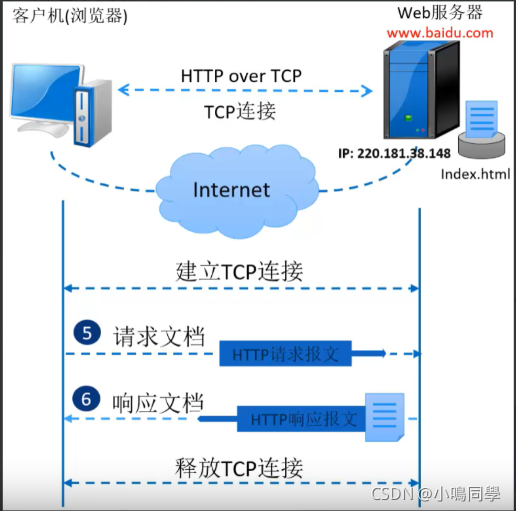
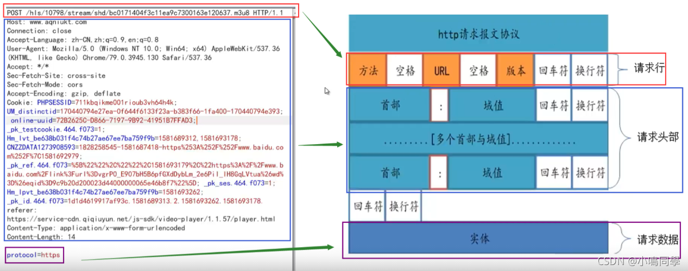
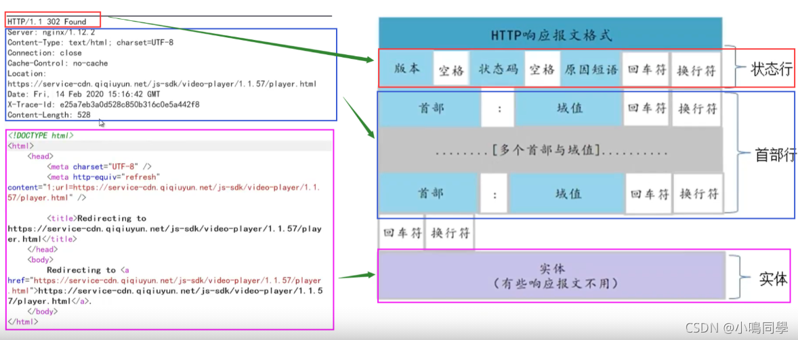
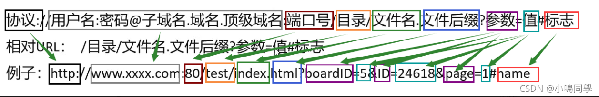
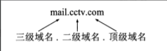
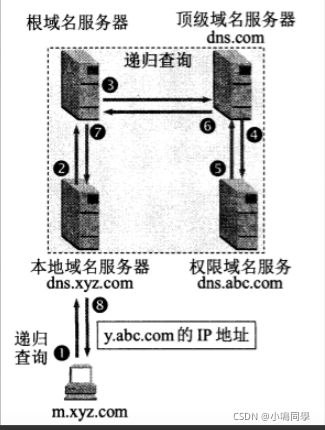
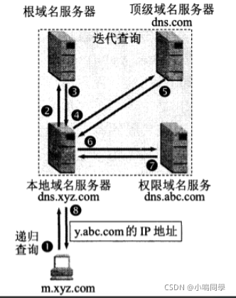

# 一、HTTP协议

## 1.1、HTTP协议和HTTPS协议
**HTTP协议** HTTP协议是面向事务的(transaction-oriented)应用层协议，它是万维网上能够可靠地交换文件(包括文本、声音、图像等各种多媒体文件)的重要基础。HTTP不仅传送完成超文本跳转所必需的信息，而且也传送任何可从互联网上得到的信息，如文本、超文本、声音和图像等。 HTTP协议目前最新版本是1.1，HTTP是一种无状态的应用层协议。无状态是指Web浏览器与Web服务器之间不需要建立持久的连接。HTTP请求只能由客户端发起，而服务器不能主动向客户端发送数据。

**HTTPS协议** HTTPS（全称：HyperText Transfer Protocol over SecureSocket Layer），是以安全为目标的HTTP通道，在HTTP的基础上通过传输加密和身份认证保证了传输过程中的安全性。

**HTTP和HTTPS的区别** HTTPS的安全基础是SSL，即在HTTP下加入SSL层。HTTPS通过安全传输机制进行转送数据，这种机制可以保护网络传送的所有数据的隐秘性和完整性，可以降低非侵入性拦截攻击的可能性。

两者的主要区别：

- HTTP是超文传输协议，信息是明文传输，HTTPS是具有安全性的SSL加密传输协议。
- HTTP和HTTPS的连接方式不同，HTTP采用80端口连接，而HTTPS采用443端口。
- HTTPS协议需要用到ca申请证书。HTTP不需要。
- HTTP连接相对简单是无状态的，而HTTPS协议是由HTTP+SSL协议构建的可进行加密传输、身份认证的网络协议，相对来说比HTTP更加安全。

## 1.2、HTTP协议工作原理
在用户访问 [http://www.baidu.com/index.html](http://www.baidu.com/index.html) 的链接后，浏览器和Web服务器执行以下动作:

1.  浏览器分析超链接中的URL 
2.  浏览器向DNS请求解析www.baidu.com的IP地址 
3.  DNS将解析出的IP地址220.181.38.148返回浏览器 
4.  浏览器与服务器建立连接(80端口) 
5.  浏览器请求文档: GET /index.html 
6.  服务器给出响应，将文档index.html发送给浏览器 
7.  释放TCP连接 
8.  浏览器显示index.htmI中的内容 

**持久性链接与非持久性链接**

1.  **持久性链接** 即在一个连接中，可以进行多次文档的请求和响应。服务器在发送完响应后，并不立即释放连接，浏览器可以使用该连接继续请求其他文档。连接保持的时间可以由双方进行协商。 

2. ** 非持久性链接** 即浏览器每请求一个Web文档， 就创建一个新的连接，当文档传输完毕后，连接就立刻被释放。 
   - HTTP 0.9、HTTP 1.0采用此连接方式。
   - 对于请求的Web页中包含多个其他文档对象(如图像、声音、视频等)的链接的情况，由于请求每个链接对应的文档都要创建新连接,所以效率低下。

## 1.3、HTTP报文分析

### 1.3.1、HTTP报文结构
**1. 请求报文** HTTP请求包含三个部分，分别是请求行（请求方法），请求头（消息报头）和请求正文。

**2. 响应报文** HTTP响应也由三部分组成，分别是响应行、响应头（消息报头）和响应正文（消息主题）。

### 1.3.2、HTTP常见请求方法
| **请求方法** | **描述** |
| --- | --- |
| **GET** | 用于获取请求页面的指定消息（以实体的形式） |
| **HEAD** | 除了服务器不能在响应里返回消息主题外。其他的都与GET方法相同 |
| **POST** | POST方法也与GET方法相似，但是GET方法没有请求内容，而POST是有请求内容的。POST多用于向服务器发送大量数据 |
| **PUT** | 请求服务器把请求中的实体存储在请求资源下。如果请求资源已经在服务器中存在。那么将会用此请求中的数据替换原先的数 |
| **DELETE** | 请求源服务器删除请求的指定资源（一般会关闭此方法，因为客户端可以进行文件删除操作）  |
| **TRACE** | 激发一个远程的应用层的请求消息回路，也就是回显服务器收到的请求。  |
| **CONNECT** | 动态切换的隧道的代理。  |
| **OPTIONS** | 请求获得有由URL标识的资源在请求/响应的通信过程中可以使用的功能选项。 |
| **PATCH** | 对 PUT 方法的补充，用来对已知资源进行局部更新 。 |

### 1.3.3、HTTP消息
HTTP消息又称为HTTP头，由四部分组成，分别是请求头、响应头、普通头和实体头。

**请求头：**请求头只出现在HTTP请求中

| **请求头** | **描述** |
| --- | --- |
| **Host** | 主要用于指定被请求资源的主机和端口号  |
| **User-Agent** | 允许客户端将他的操作系统、浏览器、和其他属性告诉服务器。 |
| **Referer** | 代表当前访问的URl的上一个URL。即用户是从什么地方来到本页面。  |
| **Cookie** | 常用来表示请求者身份。  |
| **data** | 请求被发送时的日期和时间。  |
| **Range** | 请求实体的部分内容，多线程下载一定会用到此请求头。  |
|  **x-forwar-for** | XXF头，代表请求端的IP，可以有多个。  |
| **Accept** | 指定客户端接受哪些MIME类型的消息。  |
| **Accept-Charset** | 指定客户端接受的字符集。  |
| **Accept-Encoding** | 客户端能处理的页面编码方法，如gzip。  |
| **Accept-Language** | 客户端能处理的自然语言。  |

  **响应头：**响应头是服务器根据请求向客户端发送的HTTP头

| **响应头** | **描述** |
| --- | --- |
| **Server** | 服务器所使用的Web服务器名称。  |
| **Set-Cokie** | 向客户端设置Cookie。  |
| **Last-Modified** | 资源最后修改时间  |
| **Location** | 告诉浏览器区访问哪个页面，通常和302状态码一起使用。  |
| **Refresh** | 告诉浏览器定时刷新浏览器。  |

**普通头：**在普通报头中，有少数报头用于所有的请求和响应消息，但不用于被传输的实体，只用于传输的消息。

**实体头：**请求和响应消息都可以传递一个实体头。实体头定义了关于实体正文和请求所标识的资源的元信息。

| **实体头** | **描述** |
| --- | --- |
| **Content-Type** | 向接收方指示实体的介质类型。 |
| **Content-Encoding** | 媒体类型的修饰符，它的值指示了已经被应用到实体正文的附加内容的编码。  |
| **Content-Length** | 指明实体正文的长度，以字节方式存储的十进制数字来表示。  |
| **Last-Modified** | 指示资源最后修改日期和时间。 |

### 1.3.4、HTTP状态码
HTTP协议中的状态码是由三位数字组成，第一位数字代表响应类别：

- **1xx：**表示请求已被成功接收。（100~101）
- **2xx：**服务器成功处理请求。（200~206）
- **3xx：**重定向，代表访问资源已移动，并提供新资源地址位置。（300~305）
- **4xx：**客户端错误代码。（400~415）
- **5xx：**服务器内部错误。（500~505）

**常见的状态码描述：**

| **状态码** | **描述** |
| --- | --- |
| 200 | 客户端请求成功，是最常见的状态。 |
| 204 | 请求已经成功处理，但是没有内容返回。 |
| 206 | 服务器已经完成了部分GET请求。 |
| 301 | 永久重定向，资源已永久分配新URL。 |
| 302 | 临时重定向，资源已临时分配新URL。 |
| 303 | 临时重定向，期望使用GET定向获取。 |
| 304 | 发送的附带条件请求未满足。 |
| 307 | 临时重定向，POST不会变成GET。 |
| 404 | 请求资源不存在，是最常见的状态。 |
| 400 | 客户端请求有语法错误，不能被服务器所理解。 |
| 401 | 请求未经授权。 |
| 403 | 服务器收到请求，但是拒绝提供服务。 |
| 500 | 服务器内部错误，是最常见的状态。 |
| 503 | 服务器当前不能处理客户端的请求，一段时间后可能恢复正常。 |

参考链接：[https://www.cnblogs.com/xflonga/p/9368993.html](https://www.cnblogs.com/xflonga/p/9368993.html)

## 1.4、URL
**URL定义**：URL是Uniform Resource Location的缩写，译为“统一资源定位符”。URL是从互联网上得到的资源的位置和访问方法的一种简洁的表示，是互联网上标准资源的地址。互联网上的每个文件都有一个唯一的URL。

**URL格式**

**URL中的协议**

1.  ldap-轻型目录访问协议搜索 
2.  http-超文本传输协议 
3.  file-当地电脑或网上分享的文件 
4.  https-用安全套接字层传送的超文本传输协议 
5.  news-Usenet新闻组 
6.  ftp-文件传输协议 
7.  gopher-Gopher协议 
8.  mailto-电子邮件地址 
9.  telnet-Telnet协议 

**URL编码**

1.  URL只能使用ASCI字符集来通过因特网进行发送。 
2.  URL编码使用"%"其后跟随两位的十六进制数来替换非ASCII字符。 
3.  URL不能包含空格。URL编码通常使用+来替换空格。 
4.  只有字母和数字[0-9a-zA-Z]、一些特殊符号“$-_ .+!*(),"[不包括双引号]、 以及某些保留字，才可以不经过编码直接用于URL。 

**同源策略** 同源策略（SOP）是一种约定，是浏览器的核心也是最基本的安全功能，若缺少了同源策略那么浏览器的正常功能会受到影响。同源策略是浏览器的行为，是为了保护本地的数据不被Javascript代码获取回来的数据污染。如果没有同源设计策略，那么在A.com网站加载过的js脚本，就能够在没有加载过这个脚本的B.com.上的页面随意执行并被读取，这就可能造成页面混乱、被破坏以及数据窃取等不安全的行为，比如前段跨域安全。

所谓同源是指:域名，协议，端口号三者相同。

下表给出了与 URL `http://xmtxsec.top/111/index.html` 的源进行对比的示例:

| **URL** | **结果** | **原因** |
| --- | --- | --- |
| [http://xmtxsec.top/bbb/index.html](http://xmtxsec.top/bbb/index.html) | 同源 | 只有路径不同 |
| [http://xmtxsec.top/aaa/bbb/index.html](http://xmtxsec.top/aaa/bbb/index.html) | 同源 | 只有路径不同 |
| [https://xmtxsec.top/index.html](https://xmtxsec.top/index.html) | 不同源 | 协议不同 |
| [http://xmtxsec.top:81/aaa/index.html](http://xmtxsec.top:81/aaa/index.html) | 不同源 | 端口不同  |
| [http://xmtx.top/aaa/index.html](http://xmtx.top/aaa/index.html) | 不同源 | 主机不同 |

# 二、域名解析过程

## 2.1、DNS
域名系统DNS (Domain Name System)是互联网使用的命名系统，用来把机器名字转换为IP地址。域名系统其实就是名字系统。 互联网的域名系统DNS被设计成为一个联机分布式数据库系统，并采用客户服务器方式。DNS使大多数名字都在本地进行解析(resolve)，仅少量解析需要在互联网上通信，因此DNS系统的效率很高。由于DNS是分布式系统，即使单个计算机出了故障，也不会妨碍整个DNS系统的正常运行。域名到IP地址的解析是由分布在互联网上的许多域名服务器程序(可简称为域名服务器)共同完成的。域名服务器程序在专设的结点上运行，常把运行域名服务器程序的机器称为域名服务器。

## 2.2、互联网的域名结构
互联网采用了层次树状结构的命名方法。采用这种命名方法，任何一个连接在互联网上的主机或路由器，都有一个唯一的层次结构的名字，即域名(domain name)。 这里，“域”(domain)是名字空间中一个可被管理的划分。域还可以划分为子域，而子域还可继续划分为子域的子域，这样就形成了顶级域、二级域、三级域，等等。

DNS规定，域名中的标号都由英文字母和数字组成，每一个标号不超过63个字符，也不区分大小写字母。标号中除连字符外不能使用其他的标点符号。级别最低的域名写在最左边，级别最高的顶级域名则写在最右边。由多个标号组成的完整域名总共不超过255个字符。

DNS既不规定一个域名需要包含多少个下级域名，也不规定每一级的域名代表什么意思。各级域名由其上一级的域名管理机构管理，而最高的顶级域名则由ICANN进行管理。用这种方法可使每一个域名在整个互联网范围内是唯一的， 并且也容易设计出一种查找域名的机制。

## 2.3、域名服务器
**1、 根域名服务器** 根域名服务器是最高层次的域名服务器，也是最重要的域名服务器。所有的根域名服务器都知道所有的顶级域名服务器的域名和IP 地址。不管是哪一个本地域名服务器，若要对互联网上任何一个域名进行解析(即转换为IP地址)，只要自己无法解析，就首先要求助于根域名服务器。假定所有的根域名服务器都瘫瘓了，那么整个互联网中的DNS系统就无法工作。

**2、 项级域名服务器** 项级域名服务器(即TLD服务器)，这些域名服务器负责管理在该顶级域名服务器注册的所有二级域名。当收到DNS查询请求时，就给出相应的回答(可能是最后的结果，也可能是下一步应当找的域名服务器的IP地址)。

**3、 权限域名服务器** 权限域名服务器，当一个权限域名服务器还不能给出最后的查询回答时，就会告诉发出查询请求的DNS客户，下一步应当找哪一个权限域名服务器。

**4、本地域名服务器** 当一台主机发出DNS查询请求时，这个查询请求报文就发送给本地域名服务器。每一个互联网服务提供者ISP， 或一个大学，甚至一个大学里的系，都可以拥有一个本地域名服务器，这种域名服务器有时也称为默认域名服务器。本地域名服务器离用户较近，一般不超过几个路由器的距离。当所要查询的主机也属于同一个本地ISP时，该本地域名服务器立即就能将所查询的主机名转换为它的IP地址，而不需要再去询问其他的域名服务器。

## 2.4、域名解析的方法
**1、递归查询** 主机向本地域名服务器的查询一般都是采用递归查询。递归查询就是：如果主机所询问的本地域名服务器不知道被查询域名的IP地址，那么本地域名服务器就以DNS客户的身份，向其他根域名服务器继续发出查询请求报文(即替该主机继续查询)，而不是让该主机自己进行下一步的查询。因此，递归查询返回的查询结果或者是所要查询的IP地址，或者是报错，表示无法查询到所需的IP地址。

**2、迭代查询** 本地域名服务器向根域名服务器的查询通常是采用迭代查询。迭代查询的特点：当根域名服务器收到本地域名服务器发出的迭代查询请求报文时，要么给出所要查询的IP地址，要么告诉本地域名服务器:“你下一步应当向哪一个域名服务器进行查询”。然后让本地域名服务器进行后续的查询(而不是替本地域名服务器进行后续的查询)。根域名服务器通常是把自己知道的顶级域名服务器的IP 地址告诉本地域名服务器，让本地域名服务器再向顶级域名服务器查询。顶级域名服务器在收到本地域名服务器的查询请求后，要么给出所要查询的IP地址，要么告诉本地域名服务器下一步应当向哪一个权限域名服务器进行查询，本地域名服务器就这样进行迭代查询。最后，知道了所要解析的域名的IP地址，然后把这个结果返回给发起查询的主机。当然，本地域名服务器也可以采用递归查询，这取决于最初的查询请求报文的设置是要求使用哪一种查询方式。

## 2.5、域名到IP地址的解析过程

1. 当某一个应用进程需要把主机名解析为IP地址时，该应用进程就调用解忻程序(resolver)，并成为DNS的一个客户，把待解析的域名放在DNS请求报文中，以UDP用户数据报方式发给本地域名服务器(使用UDP是为了减少开销)。
2. 本地域名服务器在查找域名后，把对应的IP地址放在回答报文中返回。
3. 应用进程获得目的主机的IP地址后即可进行通信。
4. 若本地域名服务器不能回答该请求，则此域名服务器就暂时成为DNS中的另一个客户，并向其他域名服务器发出查询请求这种过程直至找到能够回答该请求的域名服务器为止。

# 三、WEB页面解析流程

## 3.1、用户输入网址
用户在浏览器中输入网址访问网页

## 3.2、浏览器发起DNS查询
DNS服务器会根据用户提供的域名查找对应的IP地址。 DNS查找过过程如下：

1. 浏览器缓存：浏览器会缓存DNS记录一段时间，不同浏览器会记录他们各自固定的一个时间（2分钟到30分钟不等）。
2. 系统缓存：如果在浏览器缓存中没有找到需要的记录，浏览器会做一个系统调用，这样便可获得系统缓存中的记录。
3. 路由器缓存：接着前面的查询请求发向路由器，他一般会有自己的DNS缓存。
4. DNS缓存：接下来要检查的就是ISP缓存DNS的服务器。在这一般都能找到相应的缓存记录。
5. 递归搜索：DNS服务器从域名服务器开始进行递归搜索。一般DNS服务器的缓存中会有.com域名服务器中的域名，所以到顶级服务器的匹配过程不是那么必要了。

## 3.3、建立连接
浏览器通过DNS获取到web服务器的IP地址后，便向服务器发起TCP连接请求，通过TCP的三次握手建立好连接后，浏览器便可以将HTTP请求数据通过发送给服务器了。

## 3.4、浏览器发送HTTP请求
HTTP请求是基于TCP协议之上的应用层协议——超文本传输协议。一个HTTP事务由一条请求命令和一个响应结果组成。

## 3.5、WEB服务器返回响应数据
WEB服务器通过监听端口，来获取客户端的HTTP请求。与客户端建立好TCP连接后，WEB服务器开始接受客户端发来的数据，并通过中间件，从接收到的网络数据中解析出请求的url信息以及其他信息。Web服务器根据HTTP请求头的信息，得到响应数据返回给客户端。

在此过程中涉及到中间件对HTTP请求的处理，这里以Nginx为例来分析处理过程。

Nginx 处理请求过程总共划分为 11 个阶段，按顺序依次是 post-read、server-rewrite、find-config、rewrite、post-rewrite、preaccess、access、post-access、precontent、content、log。 

1. **post-read：**读取HTTP头部，读取并解析内容。
2. **server-rewrite：**在URL与location匹配之前修改请求的URL（重定向），在server块中的请求地址重写。
3. **find-config：**配置查找阶段，根据请求的URL匹配location表达式；不支持nginx模块注册处理程序，而是由ngx_http_core_module模块来完成当前请求与location配置之间的匹配
4. **rewrite：**location块追踪的请求地址重写阶段，当rewrite指令用于location中运行；ngx_lua模块中的set_by_lua指令和rewrite_by_lua指令也在这里
5. **post-rewrite：**请求地址重写提交阶段，防止递归修改URL造成死循环；由ngx_http_core_module模块实现
6. **preaccess：**访问权限检查准备阶段，http模块进入处理阶段，ngx_limit_req（访问控制的频率）和ngx_limit_zone（访问的并发率控制）也会运行
7. **access：**访问权限检查执行阶段，ngx_access和nginx_auth_request,ngx_lua的access-by_lua执行在这个阶段，配置指令多是执行访问控制性质的任务，比如检查用户的访问权限，检查用户的IP地址合法性
8. **post-access：**访问权限检查提交阶段，如果请求不被允许访问Nginx服务器，该阶段用于返回错误的响应
9. **try-files：**配置项try-files处理阶段，如果http访问的静态文件try-files配置项可以使这个请求顺序地访问多个静态文件，直至符合条件
10. **content：**内容产生阶段，大部分HTTP模块会执行，所有请求处理阶段中的重要阶段这个阶段的指令通常用来生成HTTP响应的内容
11. **log：**日志模块处理阶段，记录日志

参考链接：

## 3.6、浏览器解析返回的响应包

1. **HTML文档解析（DOM Tree）**

在浏览器没有完整的接收全部HTML文档时，它就已经开始显示这个页面。生成解析树即解析dom树，是由dom元素及属性节点组成，树的根是docunment对象。

2. **浏览器发送获取嵌入在html中的对象**

加载过程中遇到外部css文件，浏览器另外发出一个请求，来获取css文件。遇到图片资源，浏览器也会另外发出一个请求，来获取图片资源。这是异步请求，并不会影响html文档进行加载。但是当文档加载过程中遇到js文件，html文档会挂起渲染的线程，不仅要等待文档中的js文件加载完毕，还要等待解析执行完毕，才能恢复html文档的渲染线程。

3. **css解析**

浏览器下载css文件，将css文件解析为样式表对象，并来用渲染dom tree。该对象包含css规则，该规则包含选择器和声明对象。css元素遍历的顺序，是从树的低端向上遍历。

4. **js解析**

大多数浏览器让一个UI单线程共用于执行JavaScript和更新用户界面。浏览器里的HTTP请求被阻塞一般都是由js所引起，具体原因是js文件在下载完毕之后会立即执行，而js执行时候会阻塞浏览器的其他行为，有一段时间是没好网络请求被处理的，这段空闲时间就是所谓的http请求被阻塞。之所以会阻塞UI线程的执行，是因为js能控制UI的展示，而页面加载的规则是要顺序执行，所以在碰到js代码时候UI线程会首先执行他。

# 四、CDN

## 4.2、CDN的组成
CDN是由多个节点组成的。一般来讲，CDN网络主要由中心节点、边缘节点两部分构成。

1. **中心节点：**中心节点包括CDN网管中心和全局负载均衡DNS重定向解析系统，负责整个CDN网络的分发及管理。
2. **边缘节点：**CDN边缘节点主要指异地分发节点，由负载均衡设备、高速缓存服务器两部分组成。

**负载均衡设备：**负责每个节点中各个Cache的负载均衡，保证节点的工作效率；同时还负责收集节点与周围环境的信息，保持与全局负载均衡DNS的通信，实现整个系统的负载均衡。

**高速缓存服务器**：负责存储客户网站的大量信息，就像一个靠近用户的网站服务器一样响应本地用户的访问请求。通过全局负载均衡DNS的控制，用户的请求被透明地指向离他最近的节点，节点中服务器就像网站的原始服务器一样，响应终端用户的请求。因其距离用户更近，故其响应时间才更快。

## 4.3、CDN工作过程和作用
**CND的工作过程：**

1. 用户点击网站页面上的内容URL，先经过本地DNS系统解析，如果本地DNS服务器没有相应域名的缓存，则本地DNS系统会将域名的解析权交给CNAME指向的CDN专用DNS服务器。CDN的DNS服务器将CDN的全局负载均衡设备IP地址返回给用户。
2. 用户向CDN的全局负载均衡设备发起URL访问请求。
3. CDN全局负载均衡设备基于以下这些条件的综合分析之后，区域负载均衡设备会选择一个最优的缓存服务器节点，并从缓存服务器节点处得到缓存服务器的IP地址，最终将得到的IP地址返回给全局负载均衡设备。
   1.  根据用户IP地址，判断哪一个边缘节点距用户最近；
   2. 根据用户所请求的URL中携带的内容名称，判断哪一个边缘节点上有用户所需内容；
   3. 查询各个边缘节点当前的负载情况，判断哪一个边缘节点尚有服务能力。
4. 全局负载均衡设备把服务器的IP地址返回给用户。
5. 用户向缓存服务器发起请求，缓存服务器响应用户请求，将用户所需内容传送到用户终端。如果这台缓存服务器上并没有用户想要的内容，而区域均衡设备依然将它分配给了用户，那么这台服务器就要向它的上一级缓存服务器请求内容，直至追溯到网站的源服务器将内容拉到本地。

**CND的作用：**

1. CDN技术消除了不同运营商之间互联的瓶颈造成的影响，实现了跨运营商的网络加速，保证不同网络中的用户都能得到良好的访问质量
2. 广泛分布的CDN节点加上节点之间的智能冗余机制，可以有效地预防黑客入侵以及降低各种DDoS攻击对网站的影响，同时保证较好的服务质量

# 五、WAF

## 5.1、WAF的功能
WAF是专业的应用层安全防护产品。具备威胁感知能力、HTTP/HTTPS深度检测能力、检出率高，误报率低/漏报率低、高性能、复杂环境下高稳定性。

WAF主要是通过内置的很多安全规则来进行防御。可防护常见的SQL注入、XSS、网页篡改、中间件漏洞等OWASP TOP10攻击。当发现攻击后，可将IP进行锁定，IP锁定之后将无法访问网站业务。也支持防止CC攻击，采用集中度和速率双重检测算法。

## 5.2、WAF的部署
根据WAF工作方式及原理不同可以分为四种工作模式：透明代理模式、反向代理模式、路由代理模式及端口镜像模式。前三种模式也被统称为在线模式，通常需要将WAF串行部署在WEB服务器前端，用于检测并阻断异常流量。端口镜像模式也称为离线模式，部署也相对简单，只需要将WAF旁路接在WEB服务器上游的交换机上，用于只检测异常流量。

**透明代理模式** 透明代理模式（也称网桥代理模式），当WEB客户端对服务器有连接请求时，TCP连接请求被WAF截取和监控。WAF偷偷的代理了WEB客户端和服务器之间的会话，将会话分成了两段，并基于桥模式进行转发。从WEB客户端的角度看，WEB客户端仍然是直接访问服务器，感知不到WAF的存在；从WAF工作转发原理看和透明网桥转发一样，因而称之为透明代理模式，又称之为透明桥模式。

**反向代理模式** 反向代理模式是指将真实服务器的地址映射到反向代理服务器上。此时代理服务器对外就表现为一个真实服务器。由于客户端访问的就是WAF，因此在WAF无需像其它模式一样需要采用特殊处理去劫持客户端与服务器的会话然后为其做透明代理。当代理服务器收到HTTP的请求报文后，将该请求转发给其对应的真实服务器。后台服务器接收到请求后将响应先发送给WAF设备，由WAF设备再将应答发送给客户端。这个过程和透明代理其工作原理类似，唯一区别就是透明代理客户端发出的请求的目的地址就直接是后台的服务器，所以透明代理工作方式不需要在WAF上配置IP映射关系。

**路由代理模式** 路由代理模式，它与网桥透明代理的唯一区别就是该代理工作在路由转发模式而非网桥模式，其它工作原理都一样。由于工作在路由（网关）模式因此需要为WAF的转发接口配置IP地址以及路由。
