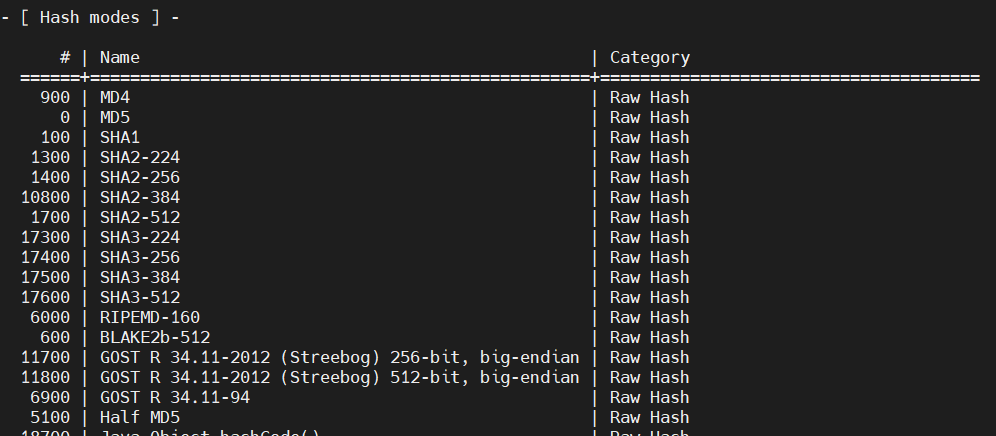
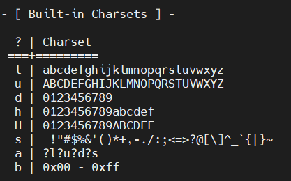

# 0X01、简介

Hashcat 是一款用于破解密码的工具，据说是世界上最快最高级的密码破解工具，支持 LM 哈希、MD5、SHA 等系列的密码破解，同时也支持 Linux、Mac、Windows 平台。

工具地址：[https://hashcat.net](https://links.jianshu.com/go?to=https%3A%2F%2Fhashcat.net)

项目地址：[https://github.com/hashcat/hashcat](https://links.jianshu.com/go?to=https%3A%2F%2Fgithub.com%2Fhashcat%2Fhashcat)


# 0X02、参数说明

## 常用参数

```python
-r  使用自定义破解规则
-o  指定破解成功后的 hash 及所对应的明文密码的存放位置
-m  指定要破解的 hash 类型，如果不指定类型，则默认是 MD5
-a  指定要使用的破解模式，其值参考后面对参数。“-a 0” 字典攻击，“-a 1” 组合攻击；“-a 3” 掩码攻击
-D  指定 opencl 的设备类型
--show      显示已经破解的 hash 及该 hash 所对应的明文
--force     忽略破解过程中的警告信息,跑单条 hash 可能需要加上此选项
--remove    删除已被破解成功的 hash
--username      忽略 hash 文件中的指定的用户名,在破解 linux 系统用户密码 hash 可能会用到
--increment     启用增量破解模式,你可以利用此模式让 hashcat 在指定的密码长度范围内执行破解过程
--increment-min         密码最小长度,后面直接等于一个整数即可,配置 increment 模式一起使用
--increment-max         密码最大长度,同上
--outfile-format        指定破解结果的输出格式 id ,默认是 3
--self-test-disable 关闭启动自检
```


## -m 参数

表示散列算法类型，运行hashcat 必须指明具体的散列算法，-m参数部分值如下：




## -a 参数

代表口令破解类型，常用的有straight 字典破解 和brute-force 暴力破解


## -D 参数

指定设备类型


## 集成字符集

可以使用掩码指定密码的每一位是什么类型的字符，前提是需要知道密码有多少位



例如：`?d?d?d?d?d?d?d?d`代表密码为8位数字，`?u?l?l?l?l?d?d?d`代表密码为7位，首个字母大写，然后三个小写字母，最后三个数字


# 0X03、实例

```python
 hashcat -a 3 -m 300 81F5E21E35407D884A6CD4A731AEBFB6AF209E1B
```

