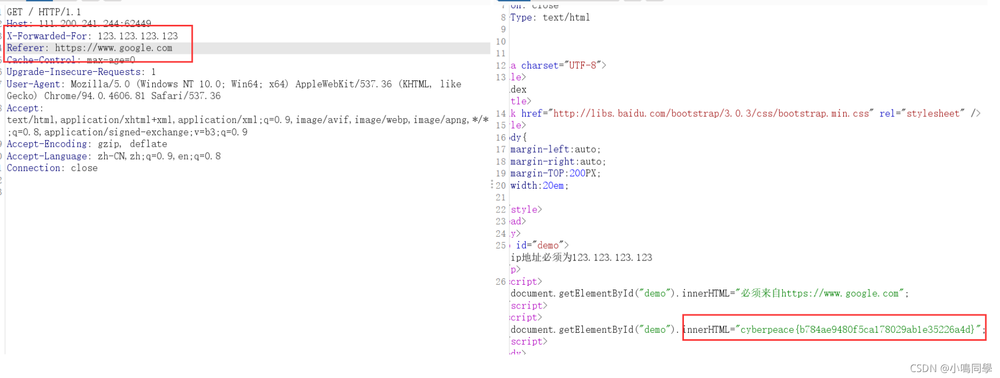
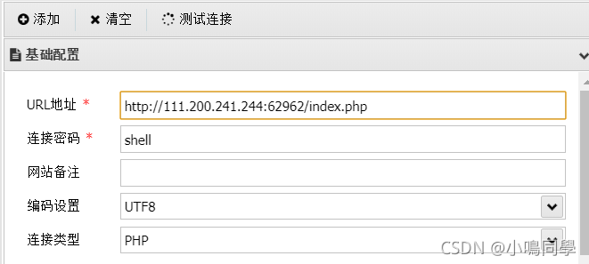
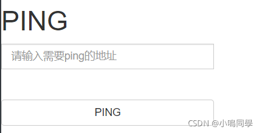

# GFSJ0481-xff_referer

**题目**

X老师告诉小宁其实xff和referer是可以伪造的。


**解题**


使用burpsuite抓包如图修改
不知道什么是X-Forwarded-For（[点这里](https://blog.csdn.net/qq_44276741/article/details/120909081)）


题目要求必须来自http:s://www.google.com


如图修改即可
不知道什么是Referer（[点这里](https://blog.csdn.net/qq_44276741/article/details/120909081)）



# GFSJ0483-webshell

**题目**

小宁百度了php一句话,觉着很有意思,并且把它放在index.php里。


**解题**


直接尝试使用蚁剑链接



成功得到flag


# GFSJ0484-command_execution

**题目**

小宁写了个ping功能,但没有写waf,X老师告诉她这是非常危险的，你知道为什么吗。


**解题**




这一看就是命令执行了，先查找flag的位置

```plain
127.0.0.1 | find / -name "flag.*"
```


然后查看flag

```plain
127.0.0.1 | cat /home/flag.txt
```


