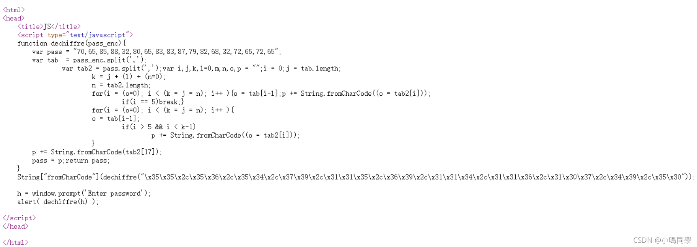

# GFSJ0408-simple_js

**题目**

小宁发现了一个网页，但却一直输不对密码。(Flag格式为 Cyberpeace{xxxxxxxxx} )


**解题**

随便输入密码，显示FAUX PASSWORD HAHA


查看网页源码



真正的密码是位于 fromCharCode


先将字符串用python处理一下，得到数组


```plain
55,56,54,79,115,69,114,116,107,49,50
```


将得到的数字分别进行ascii处理，可得到字符串


即flag为Cyberpeace{786OsErtk12}